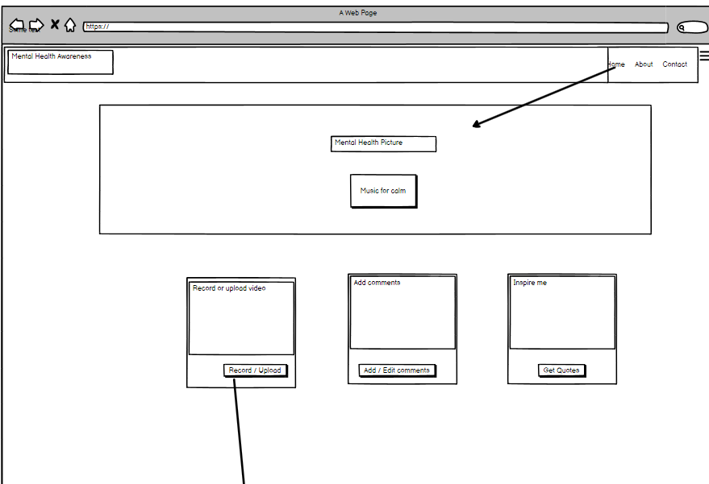
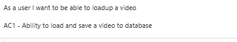
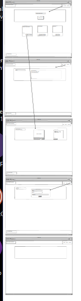
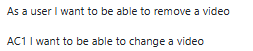

## Table Of Contents:
1. # Mental Health Awareness

## Overview
Produce a Webpage(s) to assist users with mental health awareness. The design philosophy is that many users rely on their mobile devices to access content
and in order to make access to content. Links to external resources have been checked, to ensure they can be utilised.
The main philosphy behind the website is KIS - Keep it Simple. 

The project was also used to experiment with bootstrap grid, and other html technology using Django as a framework to explore CRUD functionality

WARNING - This project is a WORK IN PROGRESS AS MUCH OF THE FUNCTIONALITY HAS NOT WORKED DUE TO TIME CONSTRAINTS
THE CRUD is in development

Please Note that the Camera App is used to record your personal video file which is intended to be downloaded and saved to a cloudinary database. Due to time constraints this is pending development.

### Purpose
This project is to provide users with an html and css website that provides information and content to support persons with resources and support for their mental health.

### Target Audience
The audience it is designed for is for those with mild mental health issues, it is intended for persons of adult 18 and over. However it can be used by children 13+ who 
are Gillick competent to make their own decisions.

The primary objective for this website is to provide resources for service users to make informed decisions.

## User Stories

### Must-Have User Stories
- **User Story 1:** Large font and easy read access
  **Acceptance Criteria:** Large and easy read font
- **User Story 2:** Access to further information and pdfs
  **Acceptance Criteria:** Access to further information for mental health awareness

(Include all prioritized must-have features)  
- Easy to the eye colours
- Simple navigation
- Big Icons

### Should-Have User Stories
- **User Story 1:** Should have large welcoming area, user knows where he is, use of logos
  **Acceptance Criteria:** List the criteria that define the successful implementation of this user story.
- **User Story 2:** Large formatted buttons with logo and text  
  **Acceptance Criteria:** User can access buttons easily with logo and text

(Include all prioritized should-have features)  
In order to enhance the functionality, there may be an opportunity to include all pdf's via a carousel, with pdf's downloaded to site or updated from a database store

### Could-Have User Stories
- **User Story 1:** Direct video contact with samaritans or counsellor.  
  **Acceptance Criteria:** Button to automatically send details from a form to an AI enhanced counsellor - working correctly from all media devices.
- **User Story 2:** A button to access a two way video link and conversation.
  **Acceptance Criteria:** Working and tested link to a support counsellor.

(Include any could-have features considered for future enhancements)  
**Guidance:** Document any optional features that are nice to have but not essential.

## Design Decisions
The main design consideration was KIS - Keeping the interface simple. Too much information on a page can be distracting and navigation for someone who may require mental health assistance 
could leave the user wondering where and what to press.

Using bootstrap as recommended simplifies the need for complex css styles.

Using Roboto, Exo and handwriting scripts from google fonts allows for standardised text easy on the eye.

Using a neutal colour and applying gradient fill should soothe the eye. The use of red was verging on pink is to slowly stimulate the user.

Psychological studies also indicate light blue to be a calming colour.

There is also the need to assist people who may require assistance with English, and using google translate gives an option to support users usually excluded.

### Wireframes
  

  

  

  
### Accessibility Considerations
 
In order to make the design accessible for all users, large jumbotron from bootstrap is used with a calming image.
The website is designed to provide information on Mental awareness, inspirational quotes and also links for further assistance.

It is not meant to replace fundamental need for trained psychological help. Links to the NHS mental help website is provided

Using large ICONS should be able to direct users to content for Mental health awareness/

## Features Implementation

### Core Features (Must-Haves)
- **Feature 1:** Easy to use buttons - in Blue in Card and Jumbotron
- **Feature 2:** Navigation to webpages

(Include all must-have features)  
The launch of meditation music to assist users with controls whilst reading inspirational quotes

### Advanced Features (Should-Haves)
- **Feature 1:** Link to Human samaritans telephone (if using a mobile phone)
- **Feature 2:** Chat  link to an AI chat mental support-bot.

### Optional Features (Could-Haves)
- **Feature 1:** Video link to a practitioner or emergency contact
- **Feature 2:** Link to emergency services, 111 or 999 for emergencies.

## Testing and Validation

### Testing Results
The webpage works on most devices. The bootstrap cards have an issue with a left margin, 
This has been frustrating as the position of cards has been affected by the bootstrap containers and card class.

The height and width of cards has not been easily managed.

Testing of buttons on cards has worked as expected. Only the home button has been setup to link back to index.html

Using chrome dev tools, divs and elements were examined. An error with favicons link appeared intermittently. This will be examined

### Validation
W3C html validation was undertaken on index.html, show.html, and edit.html and delete.html pages

Warnings but no errors detected.
W3C CSS validation was undertaken with iterative correction of typos and properties for fonts that do not exist removed.

## Deployment

### Deployment Process
Deployment to Heroku is pending

## Reflection on Development Process
The development process ideation took longer than expected. 
As this was a first project - UX phases of 

Strategy - Provide a web page / design simple to navigate and use. The rationale is to provide a positive user experience for mental health awareness. This should take approx 14 hours to complete and is within the scope of expertise for coding in html and css. To reduce too many css classes and ids, Bootstrap ver 4 will be used to assist.
Scope - Simple three pages with content to support mental health awareness with tips and quotes
Structure - As per wireframes design. It is to establish a clear context for the creation of the webpage design
Skeleton - Navigation, colours to elicit an emotional response for the site. The background image for the site is universal and dark colours may not enhance a positive outcome
Surface - This is the actual prototype for user expectations. 

### Final Thoughts
The use of bootstrap was to assist with the development of standardised simple interface for end users. 
Complex information on a webpage can be quite duanting and remove the effect of information and support

Using a simple design from Love Running, and Rosie recruitment page has ensured that KISS principles have been adhered to.

## Bugs found during testing

As part of the validation process, the cards on certain smaller devices do not centre. This could be due to the @media screen and min-width. There is also a left margin that may require tweaking
the encapsulation by a div element did not offer a solution and this could be due to the ideosyncracy of Bootstrap.

## Future Improvements
As per the could have cases, the accessibility of AI bots to provide support for the end user, and a background automatic carousel of calming pictures which the user could customise depending on his profile and cookies would provide a personalised encounter.

As part of the future technology, a picture from a mobile device could be taken and passed to an analyser to assess your para-verbal and facial ticks to get a plan created to support mental health and direct to the user to appropriate content.

If the user is an auditory type of person, the application should direct to appropriate auditory web resources.

## Resources
https://www.mentalhealth.org.uk/get-involved/mental-health-image-library
### Copilot assistance to create barebones containers for bootstrap

### Website referred to
https://developer.mozilla.org/en-US/docs/Web/CSS/text-size-adjust

# Credits

### Design from 

Codeinstitute Loverunning and Rosie Odenkirk
### Images used from 
https://www.rawpixel.com/search/old%20paper%20texture?page=1&path=_topics&sort=curated
Pexels

### Music 
Youtube.com (public domain)

### pdf
Birmingham Mental Health and Wellbeing serminar

### Thanks
Matt Edwards for assistance with github deployment issues.
### Ensure backward compatibility of components bootstrap of different versions were used.
https://stackpath.bootstrapcdn.com/bootstrap/4.3.1/css/bootstrap.min.css
https://maxcdn.bootstrapcdn.com/bootstrap/4.2.1/css/bootstrap.min.css
https://maxcdn.bootstrapcdn.com/font-awesome/4.7.0/css/font-awesome.min.css"
https://cdnjs.cloudflare.com/ajax/libs/hover.css/2.1